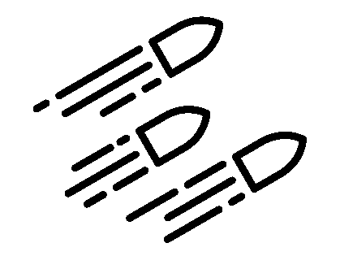
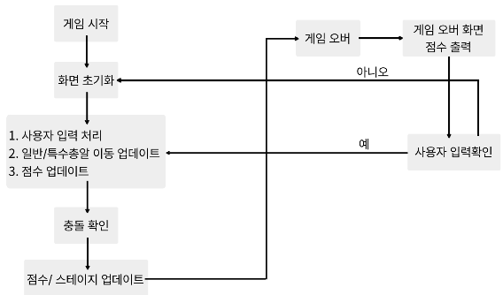

# Avoid-Bullets



## 📌 프로젝트 목표

총알을 피하며 오래 생존하는 게임을 구현한 Arm-System-Programming 기반 프로젝트입니다.  
게임 개발을 통해 ARM 시스템 프로그래밍과 C언어 활용 능력을 향상시키는 것이 목표입니다.

## 🛠️ 사용 기술 / 플랫폼

- **언어**: C  
- **플랫폼**: ARM 기반 시스템  
- **개발 도구**: [사용한 IDE 또는 컴파일러]  

## 📅 개발 일정
| 날짜   | 일정 내용 |
| :-----: | :-----: |
| 4.28   | 게임 주제 선정 |
| 4.29   | 일반 총알, 큰 총알 로직 완성 |
| 4.30   | 따라다니는 총알 로직 완성 |
| 5.1    | 생명 아이템 및 점수 시스템 추가, 게임 오버 화면, 재시작 로직 구현 |
| 5.2    | 코드 정리 |

## 🏆 게임 설명

>### 시작화면
- 게임 시작 전 배경음악 재생
- JOG 이동 시, 목숨 5개와 점수 0점, Stage 1로 게임 시작

>### 게임 종료 및 게임 점수
- 점수는 1초에 1점으로 버틴 시간에 따라 점수 부여
- 목숨이 모두 소진되면 즉시 게임 오버
- 최종 점수 출력


>### 플레이 흐름
- 무작위로 총알이 날아오며, 플레이어는 조이스틱을 활용해 상하좌우로 이동하며 총알을 회피
- Stage에 따라 총알의 속도와 패턴이 변화

>### Stage별 총알
- Stage 1: 일반 총알(속도 1)
- Stage 2: 일반 총알(속도 2) + 큰 총알(목숨 -1)
- Stage 3: 일반 총알(속도 3) + 큰 총알 + 특수 총알
- 무작위로 목숨 아이템이 생성되며, 획득 시 목숨 +1 (아이템은 10초 동안만 유지)

>### Game Flow Chart

  
## 🔑 주요 기능 및 로직 설명

> 🔫 총알 및 개체 관련 함수
```c
`static void Bullet_Init(QUERY_DRAW *b)`
일반 총알은 20개, 큰 총알은 5개로 설정됩니다.
4개의 모서리에서 랜덤으로 생성되며, 생성 위치에 따라 이동 방향이 결정됩니다.
- 위에서 생성: ↙, ↓, ↘
- 아래에서 생성: ↖, ↑, ↗
- 왼쪽에서 생성: ↗, →, ↘
- 오른쪽에서 생성: ↖, ←, ↙
```

## 💻 핵심 코드

```c
// 예시 코드
void MovePlayer(int direction) {
    // 방향에 따라 캐릭터 이동
}
