# Avoid Bullets (탄환지옥-생존의무대)

**ARM Cortex-M3(STM32) 기반 실시간 임베디드 슈팅 게임**

STM32 마이크로컨트롤러와 C 언어를 활용하여, 제한된 하드웨어 자원 내에서 실시간 게임 루프와 이벤트 기반 인터럽트 처리를 구현한 프로젝트입니다. HAL 라이브러리를 사용하지 않고 **레지스터 직접 제어(Register-level Control)** 방식을 채택하여 시스템의 동작 원리를 깊이 있게 구현했습니다.

---

## 1. 프로젝트 개요
* **수행 기간**: 2025.04.25 ~ 2025.05.02<br>
* **수행 목표**: STM32F103 환경에서의 하드웨어 자원 제어 및 타이밍/입력 처리 능력 향상<br>
* **담당 역할**: 게임 전체 구성 및 설계, 알고리즘 설계, 타이머 및 인터럽트 적용, 화면 구성 및 BGM 플레이 구현<br>

### 📅 개발 일정
| 날짜   | 일정 내용 |
| :-----: | :-----: |
| 4.28   | 게임 주제 선정 |
| 4.29   | 일반 총알, 큰 총알 로직 완성 |
| 4.30   | 따라다니는 총알 로직 완성 |
| 5.1    | 생명 아이템 및 점수 시스템 추가, 게임 오버 화면, 재시작 로직 구현 |
| 5.2    | 코드 정리 |

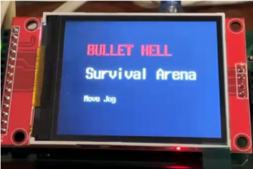

---

## 2. 개발 환경
* **Hardware**: STM32F103 (ARM Cortex-M3) Board, 320×240 LCD, CP2102 Driver
* **Language**: C 
* **Tool**: STM32CubeIDE, GCC Compiler 
* **Communication**: UART (Baud rate 115,200) 

---

## 3. 시스템 아키텍처 및 클럭 구성

### 시스템 클럭 설정 (Clock Tree)
* RCC 레지스터 직접 제어를 통해 시스템 클럭을 구성했습니다.
* **입력 소스**: 외부 8 MHz HSE (High Speed External) 활성화
* **PLL 설정**: PLL 배율을 ×9로 설정하여 **72 MHz**의 시스템 클럭 생성 

| 버스(Bus) | 주파수(Frequency) |
| :--- | :--- |
| **AHB** | 72 MHz | 
| **APB1** | 36 MHz (Max) |
| **APB2** | 72 MHz (Max) |

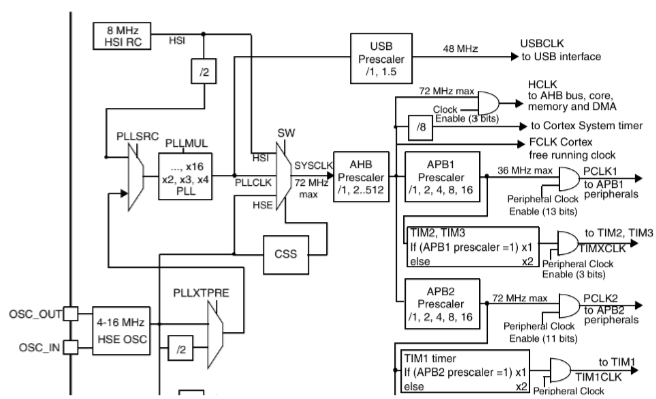

## 4. 주변장치 세부 설정

### 타이머


**TIM1, TIM3**
  - 게임 배경 음악(BGM) 또는 배경 음악 재생 타이머로 사용됩니다.
  
**TIM2**
  - 0.1초로 설정됩니다.
  - 점수와 스테이지를 관리하는 타이머로 사용됩니다.
  - 게임 오버가 되었을 때 10초 동안 키 입력을 받을 수 있는 타이머로 사용됩니다.

**TIM4**
  - 0.1초로 설정됩니다.
  - 각 단계에 따라 일반 총알의 이동 속도 업데이트를 수행합니다.
  - 2단계에서 큰 총알의 이동을 업데이트합니다.
  - 3단계에서 따라다니는 총알의 이동 업데이트 및 생성을 위한 시간 타이머로 사용됩니다.
  - 게임 전반적으로 생명 아이템의 생성 시간과 10초 동안 생성되었다가 사라지는 타이머로 사용됩니다.


### UART (USART1) 설정
RS232-USB Bridge를 사용하여 디버깅 인터페이스를 구축했으며, 레지스터를 직접 제어하여 설정했습니다.

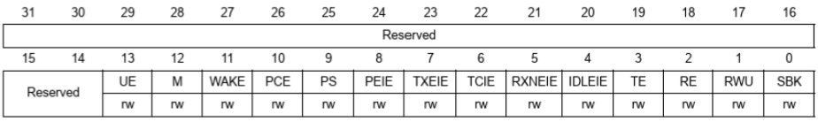

* **USART1->CR1**: UE(1), M(0, 8-bit), PCE(0), TE(1), RE(1) 설정으로 기본적인 송수신 활성화 

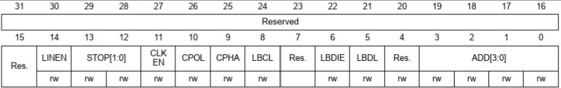

* **USART1->CR2**: STOP 비트를 1개(00)로 설정 

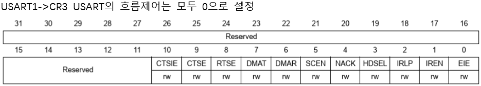

* **USART1->CR3**: 하드웨어 흐름 제어(CTS/RTS) 미사용(0) 설정

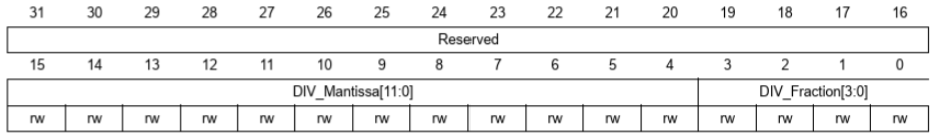

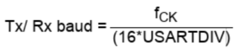

* **Baud Rate 설정 (BRR)**: 시스템 클럭(fck)과 USARTDIV 수식을 활용하여 **115,200 bps** 구현 


### GPIO 및 입력 처리

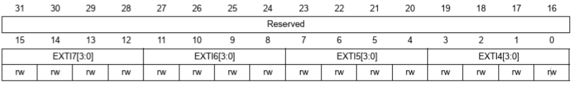

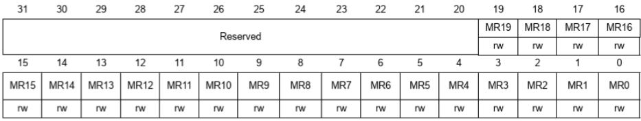

* **EXTI**: 사용자 조이스틱 입력을 `EXTI9_5` IRQ Handler에서 처리하도록 구성 
* **Pending 비트 관리**: 인터럽트 발생 후 `EXTI_PR` 레지스터의 5~7번 비트를 직접 클리어하여 관리 
* **입력 식별**: PR 레지스터 값을 기반으로 Lookup Table(LUT)을 사용하여 방향키 입력을 소프트웨어적으로 구현 

---

## 5. 주요 구현 특징

### 레지스터 레벨 제어 및 인터럽트
* **HAL 미사용**: 클럭 트리 및 주변장치 설정을 레지스터 직접 제어로 구현하여 하드웨어 이해도 극대화 
* **사용자 입력 처리**: EXTI9_5 IRQ Handler를 통해 조이스틱 입력을 처리하며, EXTI_PR 레지스터를 직접 클리어하여 펜딩 비트를 관리 
* **Lookup Table(LUT)**: PR 레지스터 값을 기반으로 LUT를 사용하여 방향키 입력을 식별 

### 실시간 객체 관리
* **메모리 구조**: 각 총알의 위치, 속도, 활성 상태를 구조체 배열로 관리하는 객체 지향적 데이터 관리 방식 적용 
* **그래픽 갱신**: 타이머 인터럽트마다 MCU 메모리에서 오브젝트 좌표를 갱신하고, 이전 위치를 지운 뒤 새 위치를 그리는 방식으로 이동 효과 구현 

---

## 6. 게임 로직 및 알고리즘

>### Flow Chart
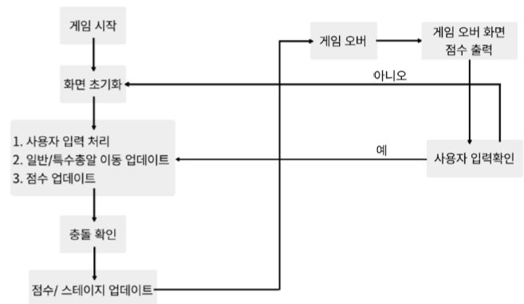

>### 시작화면
- 게임 시작 전 배경음악 재생
- JOG 이동 시, 목숨 5개와 점수 0점, Stage 1로 게임 시작

>### 게임 종료 및 게임 점수
- 점수는 1초에 1점으로 버틴 시간에 따라 점수 부여
- 목숨이 모두 소진되면 즉시 게임 오버
- 최종 점수 출력


>### 플레이 흐름
- 무작위로 총알이 날아오며, 플레이어는 조이스틱을 활용해 상하좌우로 이동하며 총알을 회피
- Stage에 따라 총알의 속도와 패턴이 변화

>### Stage별 총알
- Stage 1: 일반 총알(속도 1)
- Stage 2: 일반 총알(속도 2) + 큰 총알(목숨 -1)
- Stage 3: 일반 총알(속도 3) + 큰 총알 + 특수 총알
- 무작위로 목숨 아이템이 생성되며, 획득 시 목숨 +1 (아이템은 10초 동안만 유지)

### 주요 함수 및 로직
> 🔫 총알 관련 함수
```c
static void Bullet_Init(QUERY_DRAW *b)
일반 총알은 20개, 큰 총알은 5개로 설정됩니다.
4개의 모서리에서 랜덤으로 생성되며, 생성 위치에 따라 이동 방향이 결정됩니다.
- 위에서 생성: ↙, ↓, ↘
- 아래에서 생성: ↖, ↑, ↗
- 왼쪽에서 생성: ↗, →, ↘
- 오른쪽에서 생성: ↖, ←, ↙
```

> 🚀 개체 이동 관련 함수
```c
static int Bullet_Move(QUERY_DRAW *b)
static int Big_Move(QUERY_DRAW *b)
static int Enemy_Move(void)
static int USER_Move(int k)
일반 총알은 스테이지에 따라 이동 속도 및 각도 변경이 적용됩니다.
큰 총알은 속도 1로 고정됩니다.
따라다니는 총알은 사용자 위치로 따라가도록 로직이 설정되어 있습니다.
```

> 💥 충돌 확인 관련 함수
```c
static int Check_Collision(void)
충돌 발생 시 생명 개수를 담당합니다.
충돌 종류에 따른 생명력 변화는 다음과 같습니다.
- 일반 총알과 충돌 시: **-1**
- 큰 총알과 충돌 시: **-2**
- 따라다니는 총알과 충돌 시: **-1**
- 회복 아이템 충돌 시: **+1**
생명이 0 이하가 되면 `GAME_OVER`를 반환합니다.
```

> 회복 아이템 생성 함수
```c
static void Reset_Life_Spawn(void)
static void Spawn_Life_Item(void)
- 생명 아이템이 생성될 위치, 시간을 무작위로 설정합니다.
- 유지 시간은 메인 루프 안에서 10초 뒤에 사라지도록 설정됩니다.
- 최대 생성수는 5개로 제한됩니다.
```

---

## 7. 결과 및 고찰

### 시스템 모니터링
UART(USART1)를 통해 실시간으로 게임 상태(Stage, Life, Collision event)를 출력하여 디버깅 인터페이스를 구축했습니다.

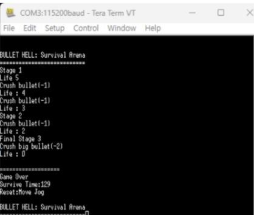

### 프로젝트 고찰
```
- 그래픽 리소스 표현을 확장하지 못한 점도 아쉬움으로 남습니다. 본 프로젝트에서는 총알과 플레이어를 단순 도형 형태로 표시했으며, 캐릭터 이미지나 총알 스프라이트와 같은 비트맵 기반 그래픽 표현까지는 구현하지 못했습니다. 사용한 STM32F103 MCU는 RAM이 20KB로 제한적이었고, 게임 로직 변수, 총알 및 오브젝트 구조체 배열, 스택 메모리, LCD 버퍼 등 기본 동작에 필요한 메모리만으로도 상당 부분을 사용하고 있었습니다.
초기 설계 단계에서 오브젝트의 동작 정보와 그래픽 리소스 데이터를 분리하고, 이미지 데이터를 플래시 메모리에 저장한 뒤 필요 시 버퍼로 불러오는 구조를 설계했다면 메모리 사용 효율을 높이면서 다양한 그래픽 표현이 가능했을 것으로 판단됩니다. 이를 통해 제한된 RAM 환경에서의 데이터 구조 설계와 메모리 관리 전략의 중요성을 체감했습니다.

- 프로젝트를 통해 단순 주변장치 제어를 넘어, 클럭 → 타이머 → 인터럽트 → 입출력 → 메모리 기반 객체 관리로 이어지는 임베디드 시스템의 전체 동작 흐름을 직접 제어하고 구현했습니다.
특히 타이머를 기능별로 분리하여 실시간 멀티태스킹 구조를 구현하고, 객체 상태를 메모리에 저장해 화면을 갱신하는 구조를 설계함으로써 펌웨어 레벨에서의 실시간 제어 시스템 설계 역량을 확보할 수 있었습니다.
```